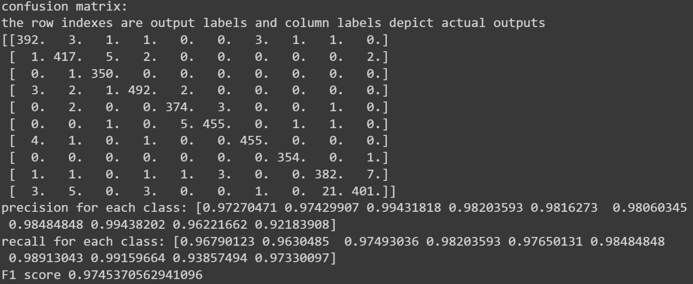

# Neural_Network_From_Scratch
This repository contains the implementations of an MLP for American Sign Language Classification with pure python. 
**Note: because of computational limits, this model has been trained on just 10 classes (Engilesh letter).**

This projects containts the following methods:
1. feedforward methods to produce the outcome of an MLP model
2. Backward methods to update the parameters.
3. evaluating the model on test data.
4. saving the model parameters.

**Note: By running the code in [training/test.py](https://github.com/taravatp/Neural_Network_From_Scratch/blob/main/testing/test.py), you can read a frame from your webcam, pass the generated keypoints to your model and see the results!**

This is the outcome of evaluating the model:

