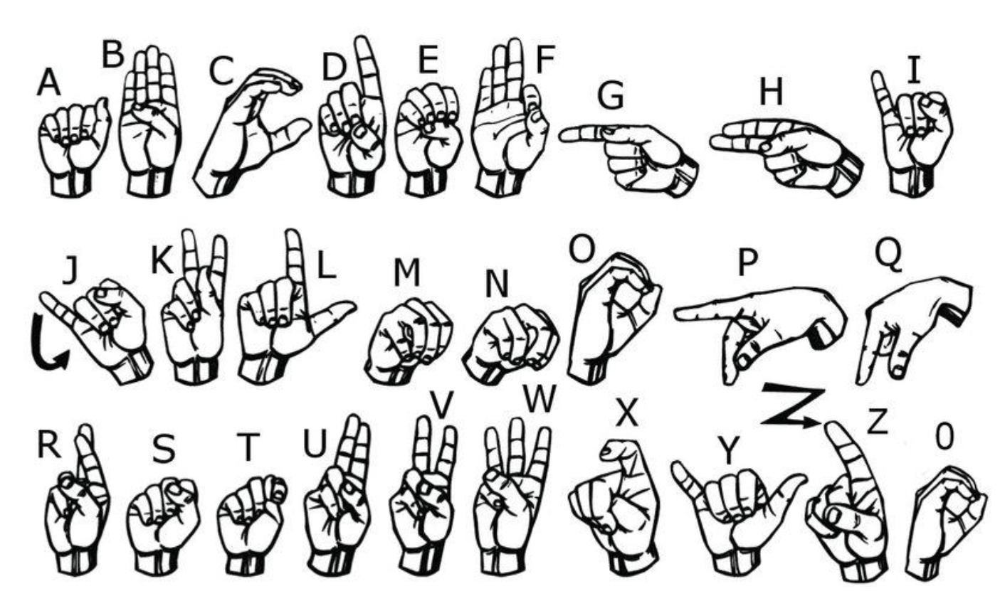
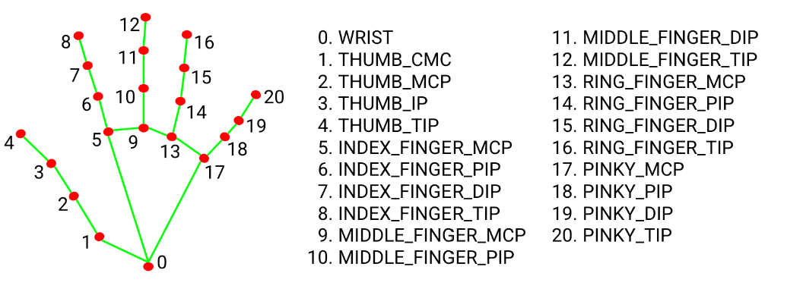
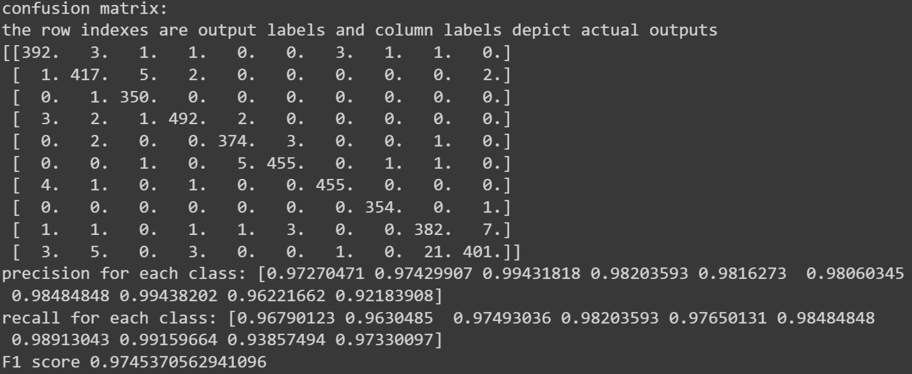

# Neural_Network_From_Scratch
This repository contains the implementations of an MLP model for American Sign Language Classification with pure python. 

As you can see in the following picture, in the american sign language each hand gesture is associated with a letter. Our task is to implement a model that learns what letter each hand gesture represents (multi-class classification task).

In order to prepare the dataset, 21 keypoints of each hand gesture in a raw image have been extracted by mediaPipe library. then their (x,y) coordinates have been stored in a .npy file. I used an already implemented code for this part.

**Note: because of computational limitations, this model has been trained on just 10 classes (Engilesh letter).**

This projects containts the following methods:
1. feedforward methods to produce the outcome of an MLP model
2. Backward methods to update the parameters.
3. training the model.
4. evaluating the model on test data.
5. saving the model parameters.

**Note: By running the code in [training/test.py](https://github.com/taravatp/Neural_Network_From_Scratch/blob/main/testing/test.py), you can read a frame from your webcam, pass the generated keypoints to your model and see the results!**

This is the outcome of model evaluation:

